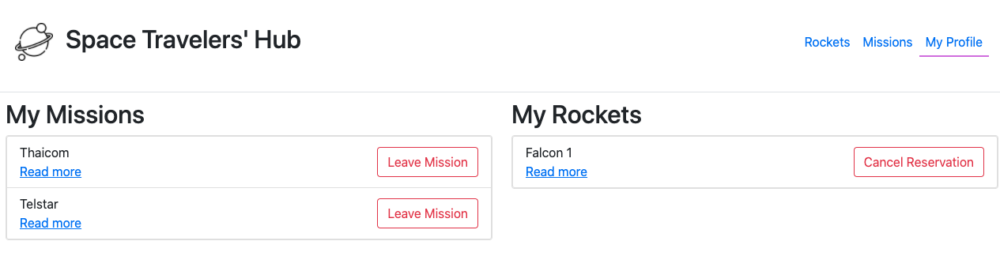
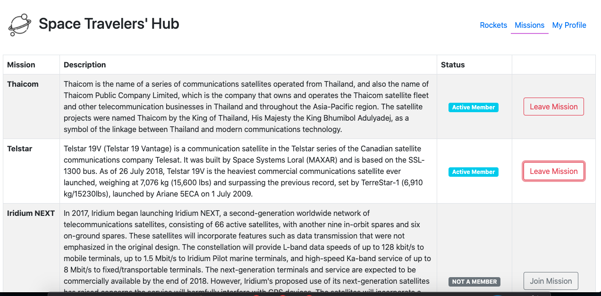
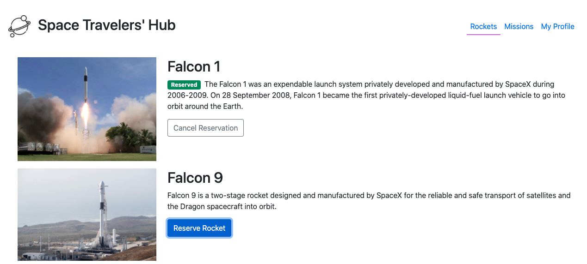

# Space X Travelers Hub (React-Redux Group Project)

- In this project, we worked with the real live data from the SpaceX API, to build a web application for a company that provides commercial and scientific space travel services. The application will allow users to book rockets and join selected space missions.

- The Space Travelers' Hub consists of Rockets, Missions, and the My Profile section.

## My Profile
The My Profile section displays all reserved rockets and space missions.

## Missions
The Missions section displays a list of current missions along with their brief description and participation status. There is also a button next to each mission that allows users to join the selected mission or leave the mission the user joined earlier.

## Rockets
The Rockets section displays a list of all available SpaceX rockets. Users can book each rocket by clicking the reservation button or cancel the previously made booking.

## Built With

- JavaScript ES6
- JSX
- HTML & CSS
- Bootstrap
- React and Redux
- Git and Github flow
- VSCode
- Linter Checkers

<!-- ## Deployment Live Demo

 - Deployed with gh-pages
  - [Live Demo](https://dansam5k.github.io/Webflix-Index/index.html) -->
## Getting Started

To get a local copy up and running follow these simple example steps.

### Prerequisites

- IDE to edit and run the code (We use Visual Studio Code 🔥).
- [Node.js](https://nodejs.org/en/download/) already downloaded.

### Install

To get a local copy up and running follow these simple example steps.
- Open terminal
- Clone this project using the command `git clone https://github.com/DanSam5K/React-Redux-SpaceX-Group-Project.git`
- `cd <clone>` folder
- Run `npm install` to install all project dependencies
- Run `npm start` in your local browser or using Live Server in Visual Studio Code.

## Author 👤 

👨‍💻 **Daniel Samuel**

- Github: [DanSam5k](https://github.com/DanSam5k)
- Twitter: [@_dan_sam](https://twitter.com/_dan_sam)
- Linkedin: [dansamuel](https://www.linkedin.com/in/dansamuel/)

👨‍💻 **Azeez Rotimi Arigbabuwo**

- Github: [@rotimiazeez](https://github.com/rotimiazeez)
- Twitter: [@harzeyzh](https://twitter.com/Harzeyzh)
- Linkedin: [@azeezrotimi019](https://www.linkedin.com/in/azeezrotimi019/)

## 🤝 Contributing

Contributions, issues, and feature requests are welcome!

Feel free to check the [issues page](hhttps://github.com/DanSam5K/React-Redux-SpaceX-Group-Project/issues).

## Show your support

Give a ⭐️ if you like this project!

## Acknowledgments

- Hat tip to anyone whose code was used 🔰
- Inspiration 💘
- Microverse program ⚡
- Our standup team 🏹
- Our family's support 🙌

## 📝 License

This project is [MIT](./LICENSE) licensed.
